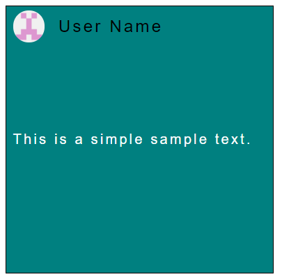

# square-post-custom-element
A simple square custom element

## Preview



## Usage

```html
<script src="square.js"></script>

...

<square-post
    avatar="avatar.png"
    width="40%"
    userName="User Name"
    text="This is a simple sample text."
    backgroundColor="#008080"
    textColor="#ffffff"></square-post>
```